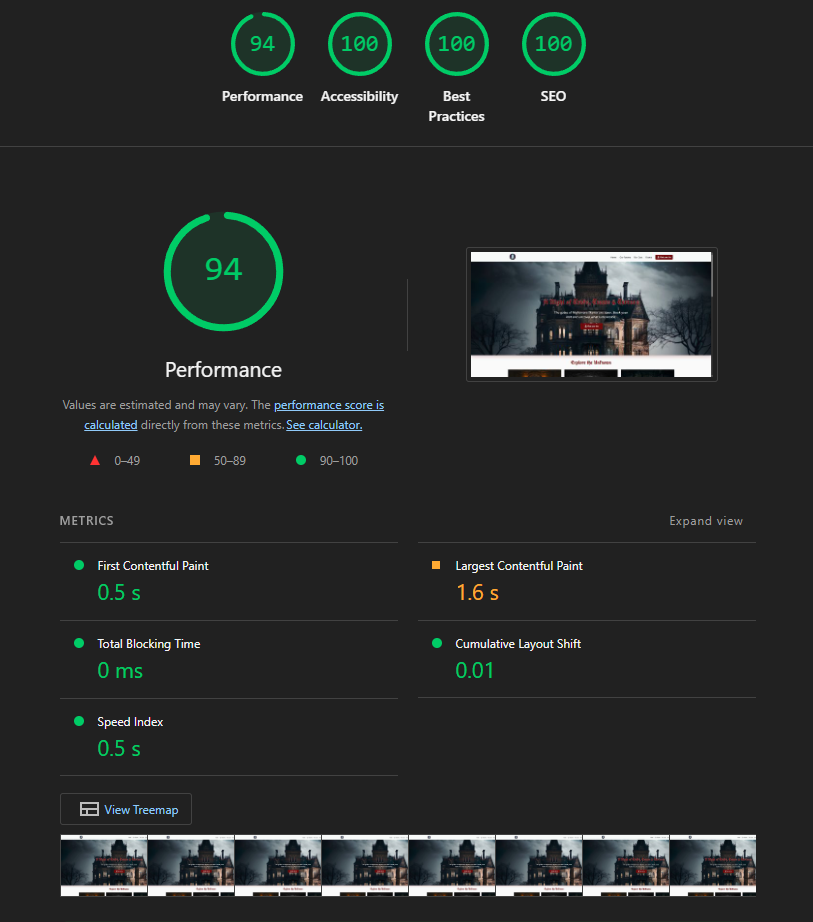
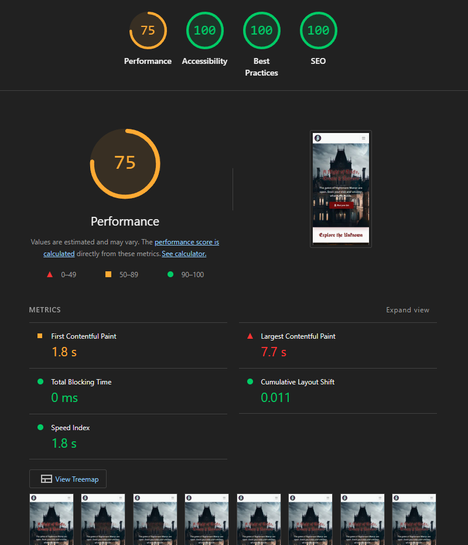
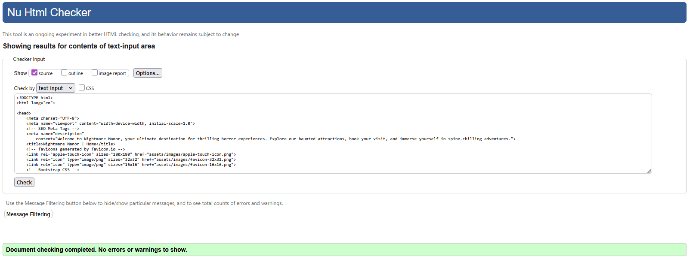

# Nightmare-Manor – Halloween Family Horror Experience

## Table of Contents
- [Project Overview](#project-overview)
- [Project Board](#project-board)
- [Tools / Technologies Used](#tools--technologies-used)
- [Wireframes / Layout](#wireframes--layout)
- [Color Palette & Typography](#color-palette--typography)
- [Screenshots](#screenshots)
- [Future Enhancements](#future-enhancements)
- [Accessibility & Validation](#accessibility--validation)

---

## Project Overview
Nightmare-Manor is a Halloween-themed interactive website designed to immerse visitors in a spooky haunted house experience. This project marks the first individual web development project for Code Institute, showcasing the application of HTML, CSS, and Bootstrap in creating an engaging, themed website.

**Visitors can explore:**

A Home/Landing page with a striking hero image and call-to-action to book a visit.
An Experience section highlighting haunted rooms and characters.
A Booking Form to schedule their visit.
A “Your Fate Is Sealed” page with animated effects for a memorable confirmation.

The project is built using HTML5, CSS3, and Bootstrap 5 for responsive layouts, with fonts from Google Fonts and thematic visuals sourced from Canva, Unsplash, and Gemini. Accessibility and visual consistency were prioritized through a carefully curated color palette and contrast-checked design.

This project serves both as a creative web development exercise and a demonstration of building immersive, interactive web experiences as part of the Code Institute curriculum. 
[View Live Project](https://blaisesa.github.io/Nightmare-Manor/)

---
## Project Board
The website is structured around three levels of features to guide development and showcase functionality:

**Must-Haves:** Core elements required for the site to be fully functional and provide the basic experience. 
**Should-Haves:** Important enhancements that improve user engagement, aesthetics, and immersion. 
**Could-Haves:** Optional extras and stretch goals that add interactivity & animation. 
[View Project Board](https://github.com/users/Blaisesa/projects/4/views/1)

  
<strong>Must-Haves</strong>

- Landing page with hero section (haunted house image + CTA)
- Navbar and footer (consistent across all pages)
- Experience section with text and images
- Booking form (Name, Email, Date/Time, Group size)
- "Your Fate Is Sealed" confirmation page with lottie animation
- Responsive layout using Bootstrap grid system

  
<strong>Should-Haves</strong>

- Image carousel/slider for teaser images on Experience page
- Spooky hover effects (glowing buttons, transitions)
- Themed Google Fonts (Creepster/Nosifer + Roboto/Montserrat)
- Form validation (HTML5 required fields)
- Footer map showing haunted house location
- Haunted experience highlights section

  
<strong>Could-Haves</strong>

- Background audio
- On screen animation using lottie
- Events section showcasing special nights
- Dark/light mode toggle

---

## Tools / Technologies Used
| Tool / Technology | Purpose |
|------------------|---------|
| [Visual Studio Code](https://code.visualstudio.com/) | Code editor for HTML, CSS, and project files |
| [HTML5](https://www.w3schools.com/html/) | Structure and markup of web pages |
| [CSS3](https://www.w3schools.com/css/default.asp) | Styling, layouts, and animations |
| [Bootstrap 5](https://getbootstrap.com/) | Responsive layout and ready-to-use components |
| [LottieFiles](https://app.lottiefiles.com/) | Adding lightweight animated illustrations |
| [Font Awesome](https://fontawesome.com/) | Icons for buttons, navigation, and visuals |
| [Google Fonts](https://fonts.google.com/) | Typography selection to match theme |
| [Coolors](https://coolors.co/) | Visualizing and setting up the color palette |
| [Canva](https://www.canva.com/) & [Unsplash](https://unsplash.com/) | Creating and sourcing images |
| [Gemini](https://gemini.google.com) | Image creation and logo design |
| [Figma](https://www.figma.com/) | Wireframes and project visualization |
| [favicon](https://favicon.io/) | Creates custom favicons for browser tabs and shortcuts. |

---

## Wireframes / Layout

  
<strong>Home Page</strong>

- Hero section with haunted house image
- Headline and spooky tagline
- Call-to-action button ("Book Your Visit")
- Sections to showcase different rooms & Characters
- Section for events
- Navbar and footer
- Responsive layout using Bootstrap

  
<strong>Booking Form</strong>

- Form fields: Name, Email, Date/Time, Group size
- Small section dedicated for lottie animation
- Submit button: "Seal Your Fate"
- Navbar and footer
- Responsive layout using Bootstrap

  
<strong>Fate Sealed Page</strong>

- Large flickering headline: "Your Fate Is Sealed"
- CSS animations (floating bats, ghosts, lightning)
- Button to return and get directions
- Navbar and footer
- Responsive layout using Bootstrap

  
<strong>Footer (with map)</strong>

- Embedded map showing haunted house location
- Navbar/footer links
- Social media icons

---

## Color Palette & Typography
<!-- List colors and fonts used -->
The color palette for Fate’s Hollow was created using Coolors.co
 to establish a cohesive theme, and all color combinations were checked for accessibility contrast using WebAIM Contrast Checker.

Fonts were selected from Google Fonts
 to match the Halloween horror theme:

Primary Font: 'UnifrakturCook', cursive — for spooky headers and headings
Secondary Font: 'Open Sans', sans-serif — for body text and readability

  
<strong>View the Colors & Fonts</strong>

| Category | Name / Usage | Hex / Font |
|----------|-------------|------------|
| **Background** | Primary | `#DFE2E2` |
|              | Secondary | `#FAFAFA` |
|              | Tertiary | `#F3F4F6` |
|              | Border | `#EDEAEA` |
| **Text**       | Primary | `#141414` |
|              | Secondary | `#6B7280` |
| **Accent**     | Primary Accent | `#700A0A` |
|              | Secondary Accent | `#32236C` |
|              | Info Link | `#232E21` |
|              | Info Link Hover | `#32533D` |
| **Fonts**      | Primary Font | `'UnifrakturCook', cursive` |
|              | Secondary Font | `'Open Sans', sans-serif` |

### Color Palette

### Visual Representation

---

## Screenshots
<!-- Placeholder for images of the project -->
Below is a preview of the Nightmare Manor.

|  Hero Section|  Rooms Showcase |  Footer Section |
|:---------------------------------------:|:---------------------------------------:|:---------------------------------------:|
|  Booking Section |  Success Page |

---

## Future Enhancements
<!-- Stretch goals, animations, additional features -->
- **Dark Mode Toggle:** Implement a dark mode feature to allow users to switch between light and dark themes, enhancing immersion and accessibility.
- **Background Music:** Add atmospheric background music and sound effects to reinforce the haunted house theme and improve user experience.
---

## Accessibility & Validation

To ensure Nightmare Manor is accessible and error-free, the following tools were used:

- **HTML Validation:** [W3C Markup Validation Service](https://validator.w3.org/) was used to check for HTML errors and ensure semantic markup.
- **CSS Validation:** [W3C CSS Validator](https://jigsaw.w3.org/css-validator/) was used to verify CSS syntax and compatibility.
- **Performance & Accessibility:** [Lighthouse](https://developer.chrome.com/docs/lighthouse/overview/) audits were run to assess performance, accessibility and best practices.

  
<strong>Validation Results</strong>

- **HTML:** No critical errors; minor warnings addressed for improved semantics.
- **CSS:** Passed validation with no major issues.
- **Lighthouse:** Scores above 90 for Performance, 100 for Accessibility and 100 for Best Practices on Desktop & above 70 on mobile for performance. 

|  |  |
|:---------------------------------------:|:---------------------------------------:|

|  |  |
|:---------------------------------------:|:---------------------------------------:|

